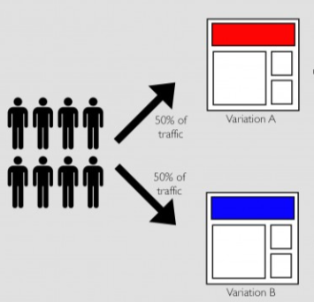

# A/B-Testing:

## A/B Testing:
A/B testing is a statistical method used to compare two versions of a product or webpage to determine which performs better based on a specific metric. In a typical A/B test, users are randomly assigned to either a control group (Version A) or a treatment group (Version B). By analyzing differences in user behavior—such as sessions, click-through rates or conversions - we can determine whether changes made in Version B lead to a statistically significant improvement over Version A.

This process helps teams make data-driven decisions and reduce the risk of rolling out ineffective or detrimental changes to all users.

## Introduction
I am solving 2 different problem statements here
### Problem 1:
An e-commerce company is A/B testing a new landing page to improve conversion rates. Users are randomly assigned to the treatment (new design) or control (existing design) group, with conversions tracked. The goal is to determine if the new design boosts conversions, optimizing product pages to enhance sales and revenue.

### Approach:
- The dataset had no missing values and the duplicate user entries (user_id) were identified and removed to ensure unbiased results.

- Verified that control group users saw the old page and treatment group users saw the new page before proceeding.

- Exploratory Data Analysis: Analyzed conversion rates for both groups using visualizations.Computed mean conversion rate, standard deviation, and standard error to assess performance differences.

#### Hypothesis Testing (Z-Test for Proportions)
Null Hypothesis (H₀): No significant difference in conversion rates between control and treatment groups.

Alternative Hypothesis (H₁): A significant difference exists.

Z-test result: p-value = 0.3545

Since p > 0.05, we fail to reject H₀ - there is no significant effect of the new design.

Chi-Squared Test for Independence (Validation)
Conducted a Chi-Square test as an additional check for significance.

Result: p-value = 0.23

Since p > 0.05, we confirm that the difference in conversions is not statistically significant.

Both hypothesis tests indicate that the new landing page did not significantly impact conversion rates.

### Problem 2:
A company conducted an A/B test to compare two website variants (A & B) for revenue impact. Users were randomly assigned a variant, and their generated revenue was recorded in an Excel file. The goal is to determine which variant drives higher revenue to optimize the website for maximum profitability.

#### Approach:
#### Data Cleaning & Preprocessing
- Removed duplicate values to ensure data integrity.
- Identified extreme revenue outliers (99th-100th percentile) and removed them.
- Observed revenue confidence intervals before and after outlier removal.

Null Hypothesis (H₀): No significant difference in revenue between Variant A (control) and Variant B.

Alternative Hypothesis (H₁): A significant difference exists in revenue between the two variants.

#### Statistical Testing Approach

- Conducted the Shapiro-Wilk test for normality → p-value = 0.000 → Data is not normally distributed.

- Used the Mann-Whitney U test (non-parametric) → p-value = 0.5129 → Failed to reject H₀.

- No statistically significant difference in revenue between Variant A and Variant B.

- Both variants performed similarly in terms of revenue generation.

###
Dataset: [Kaggle A/B Testing Dataset](https://www.kaggle.com/zhangluyuan/ab-testing)